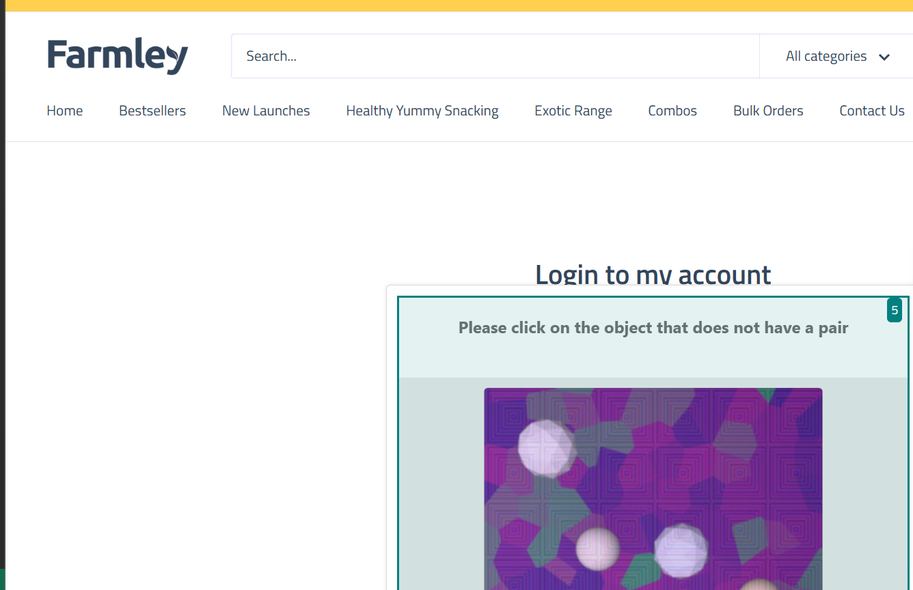

# Website Test Automation using LLM and Browser-Use

**Steps to Run**
1. **Clone the Repository**:
   ```bash
   git clone https://github.com/Adityajeet/AI_AGENT_BROWSE.git
   cd AI_AGENT_BROWSE
2. **Install the dependencies**:
   ```bash
   pip install -r requirements.txt
3. **Setup the environment:**
   Create a .env file in the root directory and Add your Google API key like this:
   ```bash
   GOOGLE_API_KEY=your_api_key_here
4. **Run the script**:
   ```bash
   python main.py
   
 **Approach to Prompt Design**
 1. The prompt is crafted carefully to guide the LLM step-by-step:
 2. Follow each instruction sequentially without skipping.
 3. Ensure elements like email/password fields are visible before interaction.
 4. If any mandatory fields cause validation errors (e.g., "Please fill out this field"), the agent is instructed to retry the steps.
 5. After completing actions, validate the expected final output (by URL or page text).
 6. Strict and clear instructions are used to minimize LLM errors or hallucinations.

**Logic Used for Execution and Validation**
1. **Prompt Building**:
Dynamically generates a task description based on the given URL and test steps.
2. **Agent Creation**:
Uses the ChatGoogleGenerativeAI (model: gemini-1.5-flash) for intelligent reasoning combined with the browser_use tool for browser automation.
3. **Execution Flow**:
   - Open the URL in a real browser.
   - Perform each step (clicking, entering email/password, logging in).
   - Handle field validation failures by re-executing the steps.
   - Verify if the final page matches the expected output by checking URL and visible DOM text.

⚡ **Challenges Faced**
1. While performing login operations, some websites triggered CAPTCHA or bot-protection challenges.
2. The browser_use agent was unable to solve CAPTCHA-based challenges, leading to test failures.

   


   


